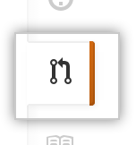
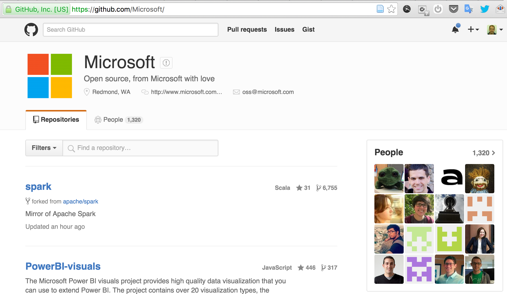

#

### Learning Management Systems based on Github A Collaborative Coding Online Service

#### Reuven Yagel

Software Engineering Department

Azrieli - The Jerusalem College of Engineering

[robi@jce.ac.il](mailto://robi@jce.ac.il)

###### 16/2/16
###### Markdown Slides on [gh](https://github.com/robi-y/presentations) using [reveal.js](https://github.com/hakimel/reveal.js)

Note:

Github usage poll

---

## Agenda

- Project Management Services and Github
- Teaching usage, pros and cons
- Application for software engineering courses
- Examples
- Resources
- Discussion
###### 

---

## About Github 

- Project management: code, docs, issues <!-- .element: class="fragment highlight-current-blue" -->
- Based on the git DVCS <!-- .element: class="fragment highlight-current-blue" -->
- Free for open source projects, but also private and enterprise services <!-- .element: class="fragment highlight-current-blue" -->
-  Branches and pull request interface, other services, e.g. static site hosting, integrations <!-- .element: class="fragment highlight-current-blue" --> 

#

--

## [github.com/about](https://github.com/about)
    
- 12M+ users (developers?), 31M+ repositories <!-- .element: class="fragment highlight-current-blue" -->
- Not only for software development <!-- .element: class="fragment highlight-current-blue" -->
  - [wired.com/2013/09/github-for-anything](http://www.wired.com/2013/09/github-for-anything)
  - [infoworld.com/article/.../github-for-the-rest-of-us](http://www.infoworld.com/article/2886828/collaboration-software/github-for-the-rest-of-us.html)
- Popular as SE research target:<!-- .element: class="fragment highlight-current-blue" -->

--

### [www.pc.co.il/featured/206881/](http://www.pc.co.il/featured/206881/)

--

### [github.com/Microsoft](https://github.com/Microsoft/)

---

## Usages for Software Engineering Courses

- Course material hosting <!-- .element: class="fragment highlight-current-blue" -->
- Assignemts: instructions, examples & starter code <!-- .element: class="fragment highlight-current-blue" -->
- Students' project management <!-- .element: class="fragment highlight-current-blue" -->

- Submission & review  <!-- .element: class="fragment highlight-current-blue" -->
  - e.g., through pull requests<!-- .element: class="fragment highlight-current-blue" --> 

---

## Benefits

- Feature rich, especially for team work <!-- .element: class="fragment highlight-current-blue" -->
  - Others: SourceForge, BitBucket, GitLab, ...
- Culture: openness, transparency, collaboration / social <!-- .element: class="fragment highlight-current-blue" -->
- Reuse and share course content (other instructors, students) <!-- .element: class="fragment highlight-current-blue" -->
- Industry relevant <!-- .element: class="fragment highlight-current-blue" -->
  - Academic licenses
  - building professional portfolio 

<github-badge user="mojombo" badge="octo"></github-badge>
 <!-- .element: class="p" -->

---

 ## Limitations
 
- Vendor lock <!-- .element: class="fragment highlight-current-blue" -->
- Entry barriers, Usability issues with git <!-- .element: class="fragment highlight-current-blue" -->
- Missing features and services: <!-- .element: class="fragment highlight-current-blue" -->
   - class management, forums, ...
   - Advcaned PM tools
   - -> 3rd party
- Copyright issues <!-- .element: class="fragment highlight-current-blue" -->
- Validity of measured metrics <!-- .element: class="fragment highlight-current-blue" -->

> Chris Wanstrath (github co-founder):  "[people came to github inspite of git](https://www.youtube.com/watch?v=6-FqUO_RzUo)"

---

## Examples

- [Course wiki](https://github.com/jce-il/se-class/wiki/)
- [Course materials](http://jce-il.github.io/se-class16b/modules/)
- [Assignments](https://github.com/jce-il/TDD-Kata-FindAPerson) / Starter code
- Review & [Feedback](https://github.com/jce-il/TDD-Kata-FindAPerson/pull/4/commits)

--

--

--

--

---

## Related Resources

0. [GitHub for Education](http://software-carpentry.org/blog/2012/04/github-for-education.html), G. Wilson, Software Carpentry Blog, '12
0. [The Emergence of GitHub as a Collaborative Platform for Education](http://dl.acm.org/citation.cfm?id=2675284), CSCW '15 ([slides](https://speakerdeck.com/alexeyza/the-emergence-of-github-as-a-collaborative-platform-for-education))
0. More on abstract

---

## Conclusions & Discussion

- Potential for relevant and meaningful learning <!-- .element: class="fragment highlight-current-blue" -->
  - Especially for software engineering
- Issue of plagiarism in an open knowledge era <!-- .element: class="fragment highlight-current-blue" -->
- Currently, not friendly enough <!-- .element: class="fragment highlight-current-blue" -->
  - Still emerging, e.g., [classroom.github.com](classroom.github.com)
  
##Thank you! <!-- .element: class="fragment grow" -->
